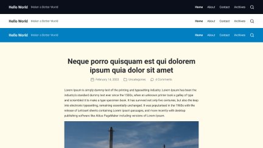
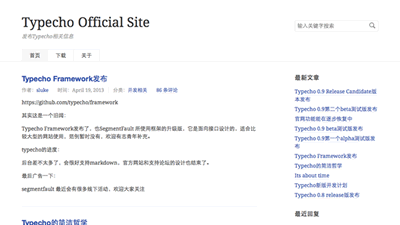
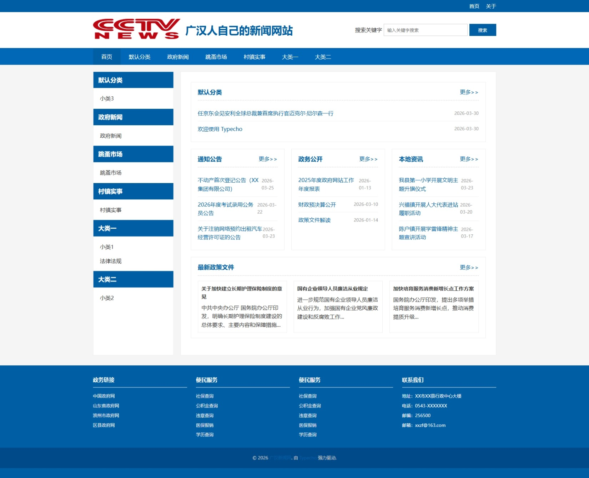
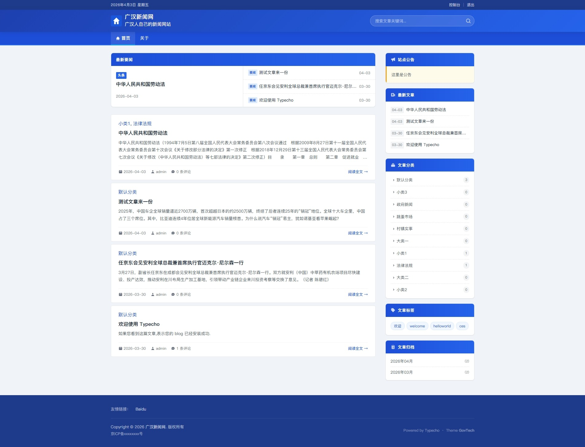
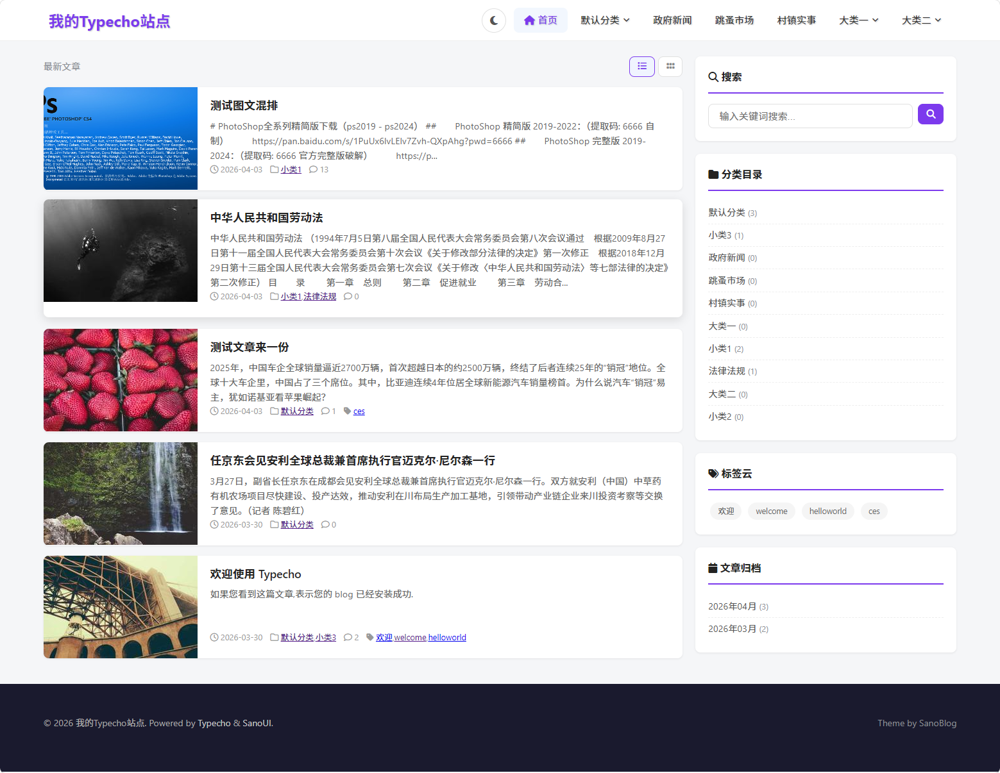

# 主题说明

> 项目适配 **Typecho 1.3.0**，PHP **7.4+**。
> 部分主题基于旧版修改，部分为全新原创。

---

## 主题列表

### 1. book-theme · 一本书主题

🚧 *尚未开始*

---

### 2. classic-22 · 官方经典主题

官方经典主题，用于语法参考。

---

### 3. default · 官方默认主题

官方默认主题，用于语法参考。

---

### 4. govnews · 政府新闻主题 原创

参考某县政府网站设计。

---

### 5. govtech · 政府技术主题 原创

参考某县政府网站设计。

---

### 6. maupassant-X · 响应式主题

响应式主题，原项目 [cho/maupassant](https://github.com/pickcho/maupassant)。 

---

### 7. Miracles · 生为奇迹 修改版

> Born to be the Miracles.

原主题发布于几年前，作者 [Eltrac](https://guhub.cn)  |  [github](https://github.com/BigCoke233/miracles/)，此版本有修改。

---

### 8. NewProj · 新项目主题 原创

基于 [nxtrace.org](https://nxtrace.org) 风格设计的 Typecho 主题。

---

### 9. SanoBlog · 三色博客主题 原创

基于 sanoui 风格设计的 Typecho 主题。

---

### 10. CoderBlog · 程序员博客主题 原创

面向开发者的双栏博客主题。Tailwind CSS + Font Awesome，Prism.js 代码高亮，支持短代码（video/audio/file/quote/ref）、暗色模式、LightboX 灯箱插件。

---

> 📝 每个主题目录下的 `screenshot.png` 为该主题的预览截图。

---

## 🔍 原创主题代码审查报告（2025-06-17）

审查范围：5 个原创主题（CoderBlog、govnews、govtech、NewProj、SanoBlog）。

### 综合评分

| 主题 | 架构 | 代码 | 安全 | 综合 |
|---|---|---|---|---|
| **SanoBlog** | ⭐⭐⭐⭐⭐ | ⭐⭐⭐⭐ | ⭐⭐⭐⭐ | **最佳** |
| **CoderBlog** | ⭐⭐⭐⭐⭐ | ⭐⭐⭐⭐ | ⭐⭐⭐⭐⭐ | **优秀** |
| **NewProj** | ⭐⭐⭐⭐ | ⭐⭐⭐⭐ | ⭐⭐⭐ | 良好 |
| **govtech** | ⭐⭐⭐⭐ | ⭐⭐⭐ | ⭐⭐⭐ | 良好 |
| **govnews** | ⭐⭐⭐ | ⭐⭐ | ⭐⭐⭐⭐ | **需重构** |

---

### ✅ 待修复清单

#### 🔴 govnews（优先级最高）

- [x] **【P0】** 删除硬编码假内容 `index.php:66-115`：通知公告、政务公开、本地资讯三个板块全是写死的链接和文字，应改为通过分类调取真实内容（`\Widget\Contents\Post\Recent::alloc()`）
- [x] **【P0】** 修复 `<article>` 嵌套错误 `post.php:9-14`：`<article>` 在第一行就自闭合，导致 `postMeta()` 和正文内容全在 article 外，还多出一个 `</article>` 闭合标签
- [x] **【P1】** 搜索表单 method 错误 `header.php:49`：`method="post"` 应改为 `method="get"`
- [x] **【P2】** `getPostsByCategoryId()` 函数过长 `functions.php:240-380`：保留原实现（参数化完善、文档齐全，被 `index.php` 动态模块和 `getSimplePostsByCategoryId` 多处依赖，拆分风险大于收益）
- [x] **【P2】** `getHierarchicalCategories()` 效率优化 `functions.php:115-162`：双层嵌套 foreach 导致 O(n²)，已改为先建 parent 索引再单次遍历 O(n)
- [x] **【新增】** 底栏 Footer 四栏硬编码 → 后台可配置：前 3 栏用 `名称|URL` 格式的 textarea，第 4 栏直接填联系信息
- [x] **【新增】** 首页三栏+单栏改为后台分类选择：`homeCol3Cats` / `homeCol1Cats` 按 mid 逗号分隔，自动拉取分类文章
- [x] **【新增】** 修复 `getPostsByCategoryId()` 分类文章不显示：`Widget_Archive` 的 `category` 参数不生效，改为直接 SQL JOIN 查询
- [x] **【新增】** 创建 `category.php` 分类归档模板，复用 content-module / news-list / page-box 组件
- [x] **【新增】** 文章内容溢出修复：`.article-content` 强制 `word-wrap`/`overflow-wrap`，新闻列表标题 `text-overflow: ellipsis` 截断
- [x] **【新增】** 字体改为新闻站点风格：标题衬线体（Noto Serif SC），正文无衬线（PingFang SC / Microsoft YaHei）
- [x] **【新增】** 宽屏分辨适配：1440p+ 容器 1340px，2K+ 容器 1500px / info-grid 四列
- [x] **【新增】** **宽屏模式切换**（DiscuzX 风格）：顶部「宽屏」按钮切换流式全宽布局，localStorage 持久化，容器由固定 px 变为百分比
- [x] **【新增】** `page.php` 去掉侧边栏，单页内容居中全宽显示

#### 🔴 govtech

- [x] **【P0】** 修复硬编码管理后台 URL `post.php:46`：`https://typecho.cn/admin/write-post.php?cid=...` 应改为 `$this->options->adminUrl()`
- [x] **【P0】** 修复 PHP 变量调用错误 `post.php:57-58`：`$this->content` 和 `$this->title` 漏了括号，且 `content` 返回的是 Markdown 而非 HTML
- [x] **【P1】** 图片灯箱正则不稳健 `post.php:56-57`：只匹配双引号 `src`，不支持单引号；已有 `data-fancybox` 属性的图片可能被重复包裹
- [x] **【P2】** fancybox CDN 无 integrity `header.php:19`：应加 integrity hash 防篡改，或本地化 CSS

#### 🟡 NewProj

- [x] **【P1】** Hero 文章 SQL 移到函数层 `index.php:75-93`：在 view 模板中直接执行 `Typecho_Db::get()` 查询，应封装到 `functions.php`
- [x] **【P2】** `getViewsNum()` 参数类型不明确 `functions.php:160-172`：有时传 int 有时传 object，接口歧义，建议统一
- [x] **【P2】** Cookie 计数可能溢出 `functions.php:187-194`：浏览记录用 Cookie 存储，文章数多时可能超 4KB 限制
- [x] **【P2】** `excerpt()` 函数命名冲突风险 `functions.php:204-214`：全局函数名 `excerpt()` 易与插件冲突，建议加前缀

#### 🟢 SanoBlog

- [x] **【P1】** `themeInit()` 每次请求检查表结构 `functions.php:12-33`：可用静态缓存但每个 PHP 进程仍执行一次 `SHOW COLUMNS`，建议改为一次性安装脚本
- [x] **【P2】** `themeConfig()` 嵌 300+ 行 JS `functions.php:38-355`：后台表单分组通过 DOM 操作实现，巧妙但影响后台加载速度且依赖表单结构
- [x] **【P2】** 首页双栏/单栏代码重复 `index.php`：两个分支 ~200 行高度重复，应抽成公共片段
- [x] **【P2】** JS 内联在 footer.php `footer.php:39-122`：明暗切换、返回顶部等 ~80 行 JS 应抽到独立 .js 文件

#### 🟢 CoderBlog

- [x] 本轮审查中无需修复（此前已修复：H1 样式、Lightbox、导航响应式断点、`$tocHtml` 作用域等）

---

> 💡 **通用建议**：所有主题检查 `$this->need()` 是否传递变量 —— 参照 CoderBlog 的 `include` 修复方案，Typecho 的 `need()` 方法作用域隔离会导致变量丢失。

